# 
🛡️ Anson Saju | Security Architect 🤖

  

  

  
  

---

## 🏛️ Digital Forge
I specialize in building **Self-Healing Security Systems** and **Adversarial AI Agents**. My work focuses on the intersection of deep-tier defense and autonomous threat synthesis.

### 🛡️ [Project Luis](https://github.com/ansonsaju/project-Luis)
**The Security Monolith.** A zero-trust active defense platform with identity-locked AST generation.
> *Status: Fully Operational | Tier: Elite Defense*

### 🤖 [Project Claudia](https://github.com/ansonsaju/project-claudia)
**The Adversary.** An autonomous tri-agent engine for automated vulnerability synthesis.
> *Status: High-Velocity | Tier: Red Team Intelligence*

---

## 🏆 Achievement Vault

  

---

## 🛠️ Laboratory Stack
- **Languages:** JavaScript (Node.js), Python, SQL
- **Security:** Adversarial AI, Zero-Trust Architecture, AST Manipulation
- **DevOps:** GitHub Actions, Docker, Railway, AWS

---

  

  <i>"Security is not a product, it’s a process bound to identity."</i> — <b>Anson Saju</b>

